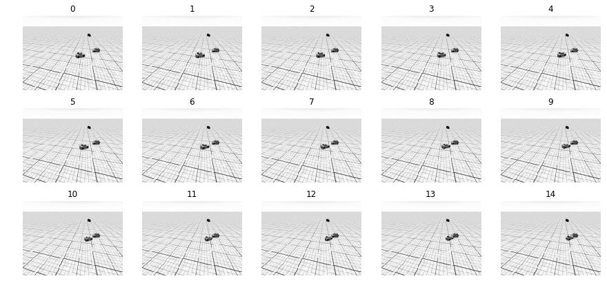

# car-accident-detection
Study on detection of accidents

This repo contains many Jupyter Notebooks Related to implementation of 3D-CNN networks for video analysis.

The most recent is the following notebook: *21-11-sliding-window-YT.ipynb*

